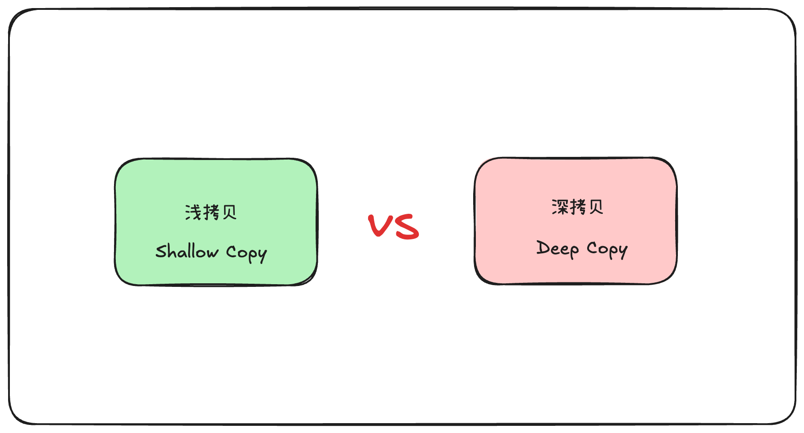

在 JavaScript 中，拷贝主要分两类：

### 浅拷贝（Shallow Copy）

- 定义：只复制对象的第一层属性；如果属性是引用类型（对象、数组等），拷贝的是引用地址，而不是值本身。
- 特点：修改拷贝后的引用对象，原对象也会被影响。
- 常见方式：

``` javascript
const obj = {a: 1, b: {c: 2}};

// Object.assign
const copy1 = Object.assign({}, obj);

// 扩展运算符
const copy2 = {...obj};
```

### 深拷贝（Deep Copy）

- 定义：不仅复制对象的第一层，还会递归复制所有层级的属性，确保新对象和原对象完全独立。
- 特点：修改拷贝对象不会影响原对象。
- 常见方式：
  
#### JSON 序列化法（简单粗暴）

``` javascript
const deepCopy = JSON.parse(JSON.stringify(obj));
```

- 优点：一行搞定
- 缺点：无法处理函数、Symbol、undefined、循环引用

#### 递归实现

``` javascript
function deepClone(obj, map = new WeakMap()) {
  if (typeof obj !== 'object' || obj === null) return obj;
  if (map.has(obj)) return map.get(obj);

  const clone = Array.isArray(obj) ? [] : {};
  map.set(obj, clone);

  for (const key in obj) {
    if (obj.hasOwnProperty(key)) {
      clone[key] = deepClone(obj[key], map);
    }
  }
  return clone;
}
```

#### structuredClone（推荐）

``` javascript
const deepCopy = structuredClone(obj);
```

- 支持大多数数据类型（包括循环引用）
- 需要现代浏览器或 Node.js 17+

#### 第三方库

``` javascript
import _ from 'lodash';
const deepCopy = _.cloneDeep(obj);
```

### 对比总结

| 特性         |       浅拷贝       |                             深拷贝 |
| :----------- | :----------------: | ---------------------------------: |
| 拷贝层级     |      仅第一层      |                           所有层级 |
| 引用数据影响 |         会         |                               不会 |
| 实现复杂度   |         低         |                                 高 |
| 常用方法     | Object.assign、... | structuredClone、递归、_.cloneDeep |

### 注意事项

- JSON 序列化法会丢失特殊类型（Date、RegExp、函数等）
- 递归要注意循环引用
- structuredClone 是未来趋势，但注意兼容性
  